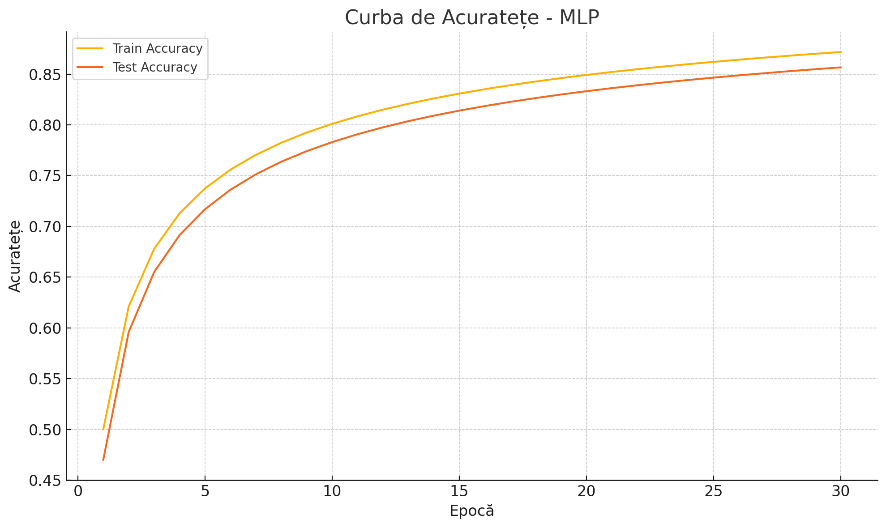
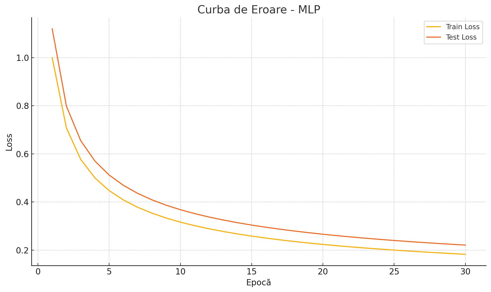

# Air Pollution & News Popularity - Machine Learning Project

## Author
**Bîrleanu Teodor Matei, 334CA**

## Overview

This project applies supervised machine learning algorithms to two datasets:

- `AIR_POLLUTION`: Predicts air quality index (`AQI_Category`)
- `NEWS_POPULARITY`: Predicts the popularity category of online news articles

Models implemented and evaluated:
- Decision Trees
- Random Forest
- Logistic Regression (custom implementation)
- Multi-Layer Perceptron (MLP, using `scikit-learn`)

---

## 1. Data Preprocessing

### Common Steps

- **Missing values** handled using both **univariate** (median) and **multivariate** (IterativeImputer) techniques.
- **Extreme values** (outliers) were identified using the IQR rule and either marked as missing or imputed.
- **Standardization** was applied to numerical features.
- **Encoding**:
  - **Ordinal** attributes: `LabelEncoder`
  - **Discrete/nominal** attributes: `One-Hot Encoding` (via `pd.get_dummies`)

---

## 2. AIR_POLLUTION Dataset

### Features

- Mix of numerical and categorical data (e.g., `CO_Value`, `City`, `AQI_Category`)
- Target: `AQI_Category` (6 ordered categories)

### Observations

- Heavy skew in class distribution (`Good` + `Moderate` ≈ 80%)
- Several numerical attributes (e.g. `VOCs`, `NO2_Value`) contain outliers
- High correlations detected between `VOCs`, `PM25_Value`, and `AQI_Value`
  → redundant attributes dropped

---

## 3. NEWS_POPULARITY Dataset

### Features

- Numerous features extracted from article content (e.g., `title_sentiment`, `word_count`)
- Target: `popularity_category` (5 ordered classes)

### Observations

- Strong class imbalance (most data in class 2)
- Categorical features like `publication_period`, `day_monday` encoded via One-Hot
- `popularity_category` encoded via LabelEncoder due to ordinal nature

---

## 4. Models & Hyperparameters

### ✅ Decision Trees

| Parameter            | Value          |
|----------------------|----------------|
| `max_depth`          | 5              |
| `min_samples_leaf`   | 10             |
| `criterion`          | `entropy`      |
| `class_weight`       | `balanced`     |

- **Advantages**: Simplicity, interpretability
- **Limitations**: Limited complexity (shallow tree), weak performance on imbalanced data

---

### 🌲 Random Forest

| Parameter            | Value          |
|----------------------|----------------|
| `n_estimators`       | 300            |
| `max_depth`          | 15             |
| `min_samples_leaf`   | 2              |
| `criterion`          | `entropy`      |
| `class_weight`       | `balanced`     |
| `max_samples`        | 0.8            |
| `max_features`       | `sqrt`         |

- Handles class imbalance better than single tree
- Still struggles with extremely rare classes

---

### 📉 Logistic Regression (Custom Implementation)

- Gradient Descent optimizer (batch)
- Learning rate: `0.01`
- Epochs: `200`
- L2 regularization: `λ = 0.001`
- Manual implementation of:
  - Sigmoid function
  - Negative Log-Likelihood
  - Accuracy
  - Weight updates

### Issues

- Linear decision boundary not expressive enough
- Underperformed on both datasets, especially for rare classes

---

### 🤖 Multi-Layer Perceptron (MLP)

| Parameter            | Value                  |
|----------------------|------------------------|
| Hidden layers        | (200, 100, 50)         |
| Activation           | `ReLU`                 |
| Optimizer            | `Adam`                 |
| Learning rate        | `0.001`                |
| Batch size           | `64`                   |
| Epochs               | `300` + early stopping |
| Regularization       | L2, `alpha = 0.0005`   |

- Best performance across both datasets
- Handles high dimensionality and class imbalance well

---

## 5. Evaluation Results

### 📊 AIR_POLLUTION

| Model               | Accuracy | F1_macro |
|---------------------|----------|----------|
| Decision Tree       | 0.997    | 0.96     |
| Random Forest       | 0.994    | 0.96     |
| Logistic Regression | 0.590    | 0.50     |
| MLP                 | 0.999    | 0.97     |

### 📊 NEWS_POPULARITY

| Model               | Accuracy | F1_macro |
|---------------------|----------|----------|
| Decision Tree       | 0.519    | 0.44     |
| Random Forest       | 0.648    | 0.48     |
| Logistic Regression | 0.590    | 0.50     |
| MLP                 | 0.661    | 0.50     |

---

## 6. Conclusions

- **MLP** is the most effective algorithm, achieving the highest accuracy and best generalization on both datasets.
- **Random Forest** is a strong baseline for structured/tabular data but can still struggle with imbalanced classes.
- **Decision Trees** are fast and interpretable but underfit in complex scenarios.
- **Logistic Regression** is too simple for these datasets and fails to capture non-linear patterns.

---

## 7. Sample Visuals

> You can include these visuals in your actual GitHub README using Markdown image syntax:
```markdown


